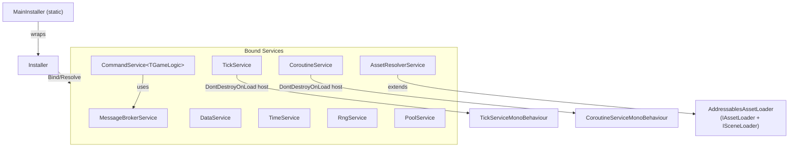

# GameLovers.Services - AI Agent Guide

> **Companion files**: `CLAUDE.md` wraps this file for Claude Code — edit `AGENTS.md`, not `CLAUDE.md`. `README.md` is the user-facing entry point; `docs/` has deep per-service API references.

## 1. Package Overview
- **Package**: `com.gamelovers.services`
- **Unity**: minimum 6000.0; compatibility reference streams 6000.0.x, 6000.3.x, and 6000.5.x. Reference editors: 6000.0.81f1, 6000.3.21f1, 6000.5.7f1 (primary). Do not call a stream validated without current matrix artifacts.
- **Dependencies** (see `package.json` — versions here must stay in sync)
  - `com.gamelovers.gamedata` (**1.0.0**) — provides `floatP`, used by `RngService`
  - `com.unity.addressables` (**1.21.20**) — asset loading and scene loading
  - `com.cysharp.unitask` (**2.5.10**) — async/await support for asset loading

This package provides a set of small, modular "foundation services" for Unity projects (service locator/DI-lite, messaging, ticking, coroutines, pooling, persistence, RNG, time, command pattern, and build version helpers) plus Addressables-based asset loading and importing tooling (absorbed from `com.gamelovers.assetsimporter` v0.5.2 in v2.0.0).

**Audience**: This file is for contributors/agents working on the package. For user-facing docs, see `README.md` (quick start, per-service examples) and `docs/` (full API reference).

## 2. Runtime Architecture (high level)

### Interface-to-Concrete Lookup

| Interface | Namespace | Implementation | File |
|-----------|-----------|---------------|------|
| `IInstaller` | `GameLovers.Services` | `Installer` | `Runtime/DependencyInjection/Installer.cs` |
| `IMessageBrokerService` | `GameLovers.Services` | `MessageBrokerService` | `Runtime/MessageBrokerService.cs` |
| `ITickService` | `GameLovers.Services` | `TickService` | `Runtime/TickService.cs` |
| `ICoroutineService` | `GameLovers.Services` | `CoroutineService` | `Runtime/CoroutineService.cs` |
| `IPoolService` | `GameLovers.Services.Pooling` | `PoolService` (ns `GameLovers.Services`) | `Runtime/Pooling/IPoolService.cs`, `Runtime/PoolService.cs` |
| `IObjectPool<T>` | `GameLovers.Services.Pooling` | `ObjectPool<T>`, `GameObjectPool`, `GameObjectPool<T>` | `Runtime/Pooling/` |
| `IDataProvider` / `IDataService` | `GameLovers.Services` | `DataService` | `Runtime/DataService.cs` |
| `ITimeService` / `ITimeManipulator` | `GameLovers.Services` | `TimeService` | `Runtime/TimeService.cs` |
| `IRngService` | `GameLovers.Services` | `RngService` | `Runtime/RngService.cs` |
| `ICommandService<TGameLogic>` | `GameLovers.Services.Commands` | `CommandService<TGameLogic>` (ns `GameLovers.Services`) | `Runtime/Commands/ICommandService.cs`, `Runtime/CommandService.cs` |
| `IGameCommand<TGameLogic>` / `IGameServerCommand<TGameLogic>` | `GameLovers.Services.Commands` | *(user-defined commands)* | `Runtime/Commands/IGameCommand.cs` |
| `IAssetLoader` | `GameLovers.Services.AssetsImporter` | `AddressablesAssetLoader` | `Runtime/AssetsImporter/AddressablesAssetLoader.cs` |
| `ISceneLoader` | `GameLovers.Services.AssetsImporter` | `AddressablesAssetLoader` | `Runtime/AssetsImporter/AddressablesAssetLoader.cs` |
| `IAssetResolverService` / `IAssetAdderService` | `GameLovers.Services` | `AssetResolverService` | `Runtime/AssetResolverService.cs` |

### Service Locator / Bindings
`Runtime/DependencyInjection/Installer.cs`, `Runtime/DependencyInjection/MainInstaller.cs`
- `Installer` stores interface type -> instance bindings; `MainInstaller` is a static global wrapper over one private `Installer`.
- Binding is **instance-based** (`Bind<T>(T instance)`), not type-to-type or lifetime-managed DI.
- Only **interfaces** can be bound; non-interface binds throw `ArgumentException`.
- `Installer` supports multi-interface binds (`Bind<T,T1,T2>` and `Bind<T,T1,T2,T3>`). `MainInstaller` exposes only single-interface `Bind<T>`.
- Re-binding the same interface throws (`Dictionary.Add`); there is no overwrite behavior.

### Messaging
`Runtime/MessageBrokerService.cs`
- Message contract: `IMessage`
- `Publish<T>` iterates subscribers directly; use `PublishSafe<T>` when handlers may subscribe/unsubscribe during publish (safe copy, extra allocation).
- `Subscribe<T>` stores subscribers by `action.Target`; static method subscriptions throw.
- `Unsubscribe<T>(null)` clears all subscribers for that message type; `UnsubscribeAll(null)` clears everything.

### Tick / Update Fan-Out
`Runtime/TickService.cs`
- Creates a `DontDestroyOnLoad` GameObject with `TickServiceMonoBehaviour` to drive Unity callbacks.
- Subscriber APIs all take `Action<float>`; `Unsubscribe(action)` removes from all Update/Fixed/Late lists.
- Type-specific unsubscribe and bulk clear APIs exist for Update, FixedUpdate, and LateUpdate.
- `deltaTime > 0` enables buffered ticking (rate-limited). `timeOverflowToNextTick` carries overflow to reduce drift.
- `realTime=true` uses `Time.realtimeSinceStartup`; `false` (default) uses `Time.time`.

### Coroutine Host
`Runtime/CoroutineService.cs`
- Creates a `DontDestroyOnLoad` GameObject with `CoroutineServiceMonoBehaviour`.
- `StartCoroutine(IEnumerator)` returns a plain Unity `Coroutine`; async variants return `IAsyncCoroutine` / `IAsyncCoroutine<T>` with completion callbacks and state.
- Delay-call argument order is action first, delay last: `StartDelayCall(Action call, float delay)` and `StartDelayCall<T>(Action<T> call, T data, float delay)`.
- `StopCoroutine(Coroutine)` and `StopAllCoroutines()` proxy through the host MonoBehaviour.

### Pooling
`Runtime/PoolService.cs`, `Runtime/Pooling/ObjectPool.cs`
- Pool registry: `PoolService : IPoolService` — one pool per type.
- Pool implementations:
  - `ObjectPool<T>` — generic; lifecycle hooks via direct cast (`IPoolEntitySpawn`, `IPoolEntityDespawn`)
  - `GameObjectPool` — `GameObject` pools; lifecycle hooks via `GetComponent<>()`; manages `SetActive`
  - `GameObjectPool<T> where T : Behaviour` — component-typed; same `GetComponent<>()` hook pattern
- `IObjectPool<T>` covers spawn/despawn/reset/clear plus `SampleEntity` and `SpawnedReadOnly`; see `docs/pool-service.md` for the full surface.
- Lifecycle hook interfaces: `IPoolEntitySpawn`, `IPoolEntitySpawn<T>`, `IPoolEntityDespawn`, `IPoolEntityObject<T>`.
- `CallOnSpawned`/`CallOnDespawned` are **virtual** in `ObjectPoolBase<T>` — override to customize lifecycle dispatch.

### Persistence
`Runtime/DataService.cs`
- `IDataProvider` is read-only (`GetData<T>()`, `HasData<T>()`); `IDataService` adds add/load/save methods.
- In-memory store is keyed by `Type` (not string). Only **reference types** (`where T : class`) are supported.
- Disk persistence via `PlayerPrefs` + `Newtonsoft.Json` serialization. Key = `typeof(T).Name`.

### Time + Manipulation
`Runtime/TimeService.cs`
- `ITimeService` is read-only time access + conversion methods; `ITimeManipulator` adds `AddTime(float)` and `SetInitialTime(DateTime)`.
- `TimeService` implements `ITimeManipulator`. Bind as `ITimeManipulator` for write access; `ITimeService` for read-only consumers.

### Deterministic RNG
`Runtime/RngService.cs`
- `RngData` / `IRngData` hold deterministic state (`Seed`, `Count`, `State`).
- `IRngService` exposes consuming (`Next`, `Range`) and non-consuming (`Peek`, `PeekRange`) APIs plus `Restore(int count)`.
- `RngService.CreateRngData(int seed)` — static factory for `RngData`.
- Float API uses `floatP` from `com.gamelovers.gamedata`.

### Command Pattern
`Runtime/CommandService.cs`
- Command contract: `IGameCommand<TGameLogic>` with `void Execute(TGameLogic, IMessageBrokerService)`.
- Server-only variant: `IGameServerCommand<TGameLogic>` with `void ExecuteLogic(TGameLogic)`.
- Service: `ICommandService<TGameLogic>` → `CommandService<TGameLogic>(TGameLogic, IMessageBrokerService)`.
- `CommandService` exposes `protected TGameLogic GameLogic` and `protected IMessageBrokerService MessageBroker` for subclassing (added in v0.15.1).
- Execution is **synchronous**. Use struct commands for fire-and-forget; class commands for reference semantics.

### Build/Version Info
`Runtime/VersionServices.cs`
- Static class for `version-data` Resources metadata. `VersionExternal` is always safe. `VersionInternal`, `Branch`, `Commit`, and `BuildNumber` auto-load via a `[RuntimeInitializeOnLoadMethod(SubsystemRegistration)]` `Bootstrap` hook and additionally lazy-load on first property access (via the private `EnsureLoaded()`) when the bootstrap hook has not yet fired. Consumers do NOT need to call `LoadVersionData()` / `LoadVersionDataAsync()` explicitly for the default flow. Both load methods remain public for explicit pre-warming.

## 3. Key Directories / Files

- **Runtime**: `Runtime/`
  - Entry points: `Runtime/DependencyInjection/Installer.cs`, `Runtime/DependencyInjection/MainInstaller.cs`
  - Foundation services (ns `GameLovers.Services`): `MessageBrokerService.cs`, `TickService.cs`, `CoroutineService.cs`, `PoolService.cs`, `DataService.cs`, `TimeService.cs`, `RngService.cs`, `VersionServices.cs`, `CommandService.cs`, `AssetResolverService.cs`
  - Command contracts (ns `GameLovers.Services.Commands`, in `Commands/`): `IGameCommand.cs`, `ICommandService.cs`
  - Pool contracts + implementations (ns `GameLovers.Services.Pooling`, in `Pooling/`): `IPoolService.cs`, `IObjectPool.cs`, `IPoolEntity.cs`, `ObjectPool.cs`, `GameObjectPool.cs`
  - Asset loading contracts + implementations (ns `GameLovers.Services.AssetsImporter`, in `AssetsImporter/`): `IAssetLoader.cs`, `ISceneLoader.cs`, `AddressablesAssetLoader.cs`, `AddressableConfig.cs`, `AssetConfigsScriptableObject.cs`, `AssetLoaderUtils.cs`, `AssetReferenceScene.cs`
- **Editor**: `Editor/` — all code here is editor-only; do not reference from runtime assemblies
  - `Editor/Versioning/` (ns `GameLovers.Services.Versioning.Editor`): `VersionEditorUtils.cs`, `GitEditorProcess.cs`, `VersioningEditorSettings.cs` (ScriptableSingleton → `ProjectSettings/VersioningEditorSettings.asset`), `VersioningMenu.cs` (`Tools > GameLovers > Versioning/...` stubs)
  - `Editor/AssetsImporter/` (ns `GameLovers.Services.AssetsImporter.Editor`): `AssetConfigsImporter.cs` (public API, user code extends), `AssetsImporterEditorSettings.cs` (ScriptableSingleton → `ProjectSettings/AssetsImporterEditorSettings.asset`), `AssetsImporterEditorUtils.cs` (discovery + import logic), `AssetsImporterMenu.cs` (`Tools > GameLovers > Assets Importer/...` stubs)
  - `Editor/AddressableIds/` (ns `GameLovers.Services.AddressableIds.Editor`): `AddressableIdsEditorSettings.cs` (ScriptableSingleton → `ProjectSettings/AddressableIdsEditorSettings.asset`, includes `IsValidIdentifier`/`IsValidNamespace` validators **and a persisted last-generation snapshot** — sorted address/label arrays + timestamp + filename/label-filter-used, written by `RecordGeneration` from inside `AddressableIdsGeneratorUtils.Generate`), `AddressableIdsGeneratorUtils.cs` (pure generation logic returning `GenerationResult`; also exposes `Diff` returning `DiffResult` and `ComputeFreshness` returning `FreshnessResult` for the Explorer tab — `Diff` is on-demand only because it runs the full `GetAssetList` + `ProcessData` scan, `ComputeFreshness` is file-stat-only and cheap), `AddressableIdsMenu.cs` (`Tools > GameLovers > Addressable Ids/...` stubs)
  - `Editor/Explorer/Windows/` (ns `GameLovers.Services.Editor.Explorer`): `ServicesExplorerWindow.cs` (exposes `SelectTab<T>()` and `OpenOnTab<T>()`), `ServicesExplorerWindow.uxml`, `ServicesExplorerWindow.uss`
  - `Editor/Explorer/Tabs/` (ns `GameLovers.Services.Editor.Explorer.Tabs`): `ServiceTab.cs` (abstract base; includes `MakePrimaryButton` helper) + 13 concrete tabs: `OverviewTab` (takes `ServicesExplorerWindow` reference for tab-jumping), `VersioningTab`, `InstallerTab`, `MessageBrokerTab`, `TickTab`, `CoroutineTab`, `PoolTab`, `DataTab`, `TimeTab`, `RngTab`, `AssetResolverTab`, `AssetsImporterTab`, `AddressableIdsTab`
  - `Editor/Inspectors/` and `Editor/Scaffolders/`: UIToolkit inspectors/property drawers and `Assets > Create > GameLovers Services > ...` scaffolders; templates live in `Editor/Scaffolders/Templates~/`
  - Assembly: `GameLovers.Services.Editor.asmdef`
- **Tests**: `Tests/`
  - Before reading, editing, or creating any file in `Tests/`, you **MUST** read [`Tests/AGENTS.md`](Tests/AGENTS.md) first.
  - `EditMode/Unit/` covers non-MonoBehaviour services plus AssetResolver/AssetLoaderUtils; `EditMode/Performance/` covers ObjectPool and MessageBroker.
  - `PlayMode/Unit/` covers Unity-hosted services/pools; `PlayMode/Integration/` includes ServiceLifecycle, VersionServices, and explicit Addressables tests; PlayMode also has performance and smoke tests.
- **Samples**: `Samples~/` — importable via Unity Package Manager. Each sample ships as a complete runnable Unity scene with hand-authored deterministic `.cs.meta` / `.unity.meta` GUIDs (matching the `Packages/com.gamelovers.uiservice/Samples~/*` pattern); the UI inside each sample is built programmatically at runtime via `UnityEngine.UI` (legacy `Text`, no TMP). See [`Samples~/README.md`](Samples~/README.md) for the index, common-mistakes section sourced from §4 below, and the canonical list of sample-only types.
  - `Samples~/ServicesPlayground/` — zero-Addressables scene exercising 10 of 13 Services Explorer tabs; uses `Bullet` (pooled MonoBehaviour), `PlayerData` (POCO), `TestMessage`/`PlayerLevelledUpMessage` (`IMessage` structs), `GameLogic`, `LevelUpCommand`, `ServicesBootstrap`, `ServicesPlaygroundUI` — all under namespace `GameLovers.Services.Samples.ServicesPlayground`. The pooled `Bullet` "sample entity" is generated as a sphere primitive at runtime in `ServicesBootstrap.GetOrCreateBulletPrefab()`.
  - `Samples~/AssetResolver/` — Addressables-required scene covering the remaining 3 Explorer tabs (Asset Resolver, Assets Importer, Addressable Ids). Uses `SpriteId` (enum), `SpriteConfigs : AssetConfigsScriptableObject<SpriteId, Sprite>`, `AssetResolverExample` driver — all under namespace `GameLovers.Services.Samples.AssetResolver`. Ships three placeholder PNGs in `Sprites/Hero.png`/`Coin.png`/`Enemy.png` plus an empty `SpriteConfigs.asset`. Editor automation in `Samples~/AssetResolver/Editor/AssetResolverSampleSetup.cs` (assembly `GameLovers.Services.Samples.AssetResolver.Editor`, namespace `GameLovers.Services.Samples.AssetResolver.Editor`) auto-marks the sprites Addressable in a dedicated group `GameLoversServicesSamples_AssetResolver`, applies the Addressables label `services-sample-asset-resolver` (registered via `settings.AddLabel` and applied per-entry via `entry.SetLabel(force: true)`), renames non-canonical filenames to `Hero/Coin/Enemy` (substring-match first, alphabetical fallback), and wires `SpriteConfigs.asset` rows. Triggered by `AssetResolverSampleAssetPostprocessor.OnPostprocessAllAssets` when paths under `/Asset Resolver/Sprites/` change, plus `Tools > GameLovers > Samples > Asset Resolver > Refresh Addressables` and a sample-scoped inspector button on the package's `AssetConfigsScriptableObjectEditor` (visible only when the inspected asset path ends with `/Asset Resolver/SpriteConfigs.asset`). The group + label are NOT auto-removed when the sample is deleted (see "Sample-removal cannot self-cleanup" gotcha in §4); the per-sample README documents the manual cleanup steps as the user's undo. The inspector button invokes the menu via `EditorApplication.ExecuteMenuItem` so the package editor assembly stays decoupled from the sample editor assembly. The sample also ships `SpriteConfigsImporter : AssetsConfigsImporter<SpriteId, Sprite, SpriteConfigs>` (empty subclass) so `AssetsImporterEditorUtils.DiscoverImporters` reflection-scan surfaces a sample row in the **Assets Importer** tab. `AssetResolverExample.Start()` calls `MainInstaller.Bind<IAssetResolverService>(...)` and `OnDestroy()` calls `MainInstaller.Clean()` — this is what populates the **Asset Resolver** tab's live `AssetMap` tree. A second sample-scoped menu `Tools > GameLovers > Samples > Asset Resolver > Open in Explorer` opens the Services Explorer focused on `AssetResolverTab`; the sample's runtime UI's "Open Services Explorer" button calls it via `EditorApplication.ExecuteMenuItem` (under `#if UNITY_EDITOR`) so the runtime assembly never references the package editor assembly. The sample's runtime files compile into a dedicated `GameLovers.Services.Samples.AssetResolver.asmdef` (NOT into the project's default `Assembly-CSharp` like `Samples~/ServicesPlayground/` does) — this is required so the sample editor assembly can `using` the sample's runtime types (`SpriteId`, `SpriteConfigs`) when declaring the concrete `SpriteConfigsImporter`. Asmdef-defined assemblies cannot reference `Assembly-CSharp`, so the moment a sample needs editor↔runtime type sharing it MUST have its own runtime asmdef. The sample editor asmdef (`GameLovers.Services.Samples.AssetResolver.Editor`) references `GameLovers.Services` (runtime), `GameLovers.Services.Editor` (for the importer base type and the `ServicesExplorerWindow.OpenOnTab<...>` call), `GameLovers.Services.Samples.AssetResolver` (the new sample runtime asmdef), and `GameLovers.GameData` (transitively required for `Pair<TId, AssetReference>` exposed by `AssetsConfigsImporterBase.OnImportIds`). The runtime asmdef references `GameLovers.Services`, `GameLovers.GameData` (for `Pair<TKey,TValue>` returned by `AssetConfigsScriptableObject.Configs`), plus the engine packages the sample's runtime code uses (`Unity.TextMeshPro`, `UnityEngine.UI`, `UniTask`, `Unity.Addressables`, `Unity.ResourceManager`, `Unity.InputSystem`); when the sample is moved into a host project at `Assets/Samples/.../Asset Resolver/`, the asmdef boundary is preserved and the prefab continues to resolve `AssetResolverExample` via its `.cs.meta` GUID even though the assembly name in `m_EditorClassIdentifier` shifts from `Assembly-CSharp` to the new asmdef name on first import.

### Folder Namespace Mapping

With `"rootNamespace": "GameLovers.Services"` on the asmdef, Unity's *Create > C# Script* auto-derives namespaces from folder paths. That is already correct for all subfolders **except** `DependencyInjection/`.

| Folder | Namespace | Notes |
|---|---|---|
| `Runtime/` (root) | `GameLovers.Services` | Concrete `*Service` classes + `AssetResolverService` |
| `Runtime/DependencyInjection/` | `GameLovers.Services` | **Carve-out** — new files here need manual namespace fix (strip `DependencyInjection` segment) |
| `Runtime/Commands/` | `GameLovers.Services.Commands` | Command contracts (interfaces only) |
| `Runtime/Pooling/` | `GameLovers.Services.Pooling` | Pool contracts + pool implementations |
| `Runtime/AssetsImporter/` | `GameLovers.Services.AssetsImporter` | Asset loading interfaces + Addressables loader |

The concrete `PoolService` stays in `Runtime/` root under `GameLovers.Services` but references types from `GameLovers.Services.Pooling` — the file declares `using GameLovers.Services.Pooling;` at the top. `CommandService` follows the same pattern with `using GameLovers.Services.Commands;`.

## 4. Important Behaviors / Gotchas

### MainInstaller API
- `MainInstaller` exposes only single-interface `Bind<T>`. Multi-interface `Bind<T, T1, T2>` is on `IInstaller`/`Installer` directly.
- There is no `MainInstaller.Instance` — it is a static class wrapping a private `Installer`.

### Message Broker Mutation Safety
- `Publish<T>` iterates subscribers directly; calling `Subscribe`/`Unsubscribe` during publish **throws**.
- Use `PublishSafe<T>` if handlers may subscribe/unsubscribe during message handling (copies delegates first, at allocation cost).
- `Subscribe` uses `action.Target` as key — **static method subscriptions throw `ArgumentException`**.

### Tick / Coroutine Host GameObjects
- `TickService` and `CoroutineService` each create a `DontDestroyOnLoad` GameObject. Call `Dispose()` to tear them down (tests, game reset, domain reload).
- These services do **not** enforce a singleton; constructing multiple instances creates multiple host GameObjects.

### IAsyncCoroutine.StopCoroutine(triggerOnComplete)
- `StopCoroutine(triggerOnComplete)` honors its parameter as of v2.0.0: `true` invokes the registered `OnComplete` callback, `false` suppresses it. After either path the coroutine flips to `IsCompleted == true` / `IsRunning == false`, and the call is a no-op if it had already completed.
- The Services Explorer's editor-only `_activeAsyncCoroutines` tracking subscribes to a separate internal `InternalCleanup` event on `AsyncCoroutine` (NOT to the public `OnComplete` setter). Do NOT route tracking through `OnComplete(...)` — the public setter has *replace* semantics and would silently overwrite (or be overwritten by) user callbacks. Any future Coroutine-tab introspection should hook `InternalCleanup` instead.

### DataService Persistence
- Keys in `PlayerPrefs` are `typeof(T).Name` — name collisions are possible across assemblies with types sharing the same name.
- `LoadData<T>` uses `Activator.CreateInstance<T>()` when no saved data exists; `T` must have a **parameterless constructor**.
- Only reference types (`class`) are supported; value types (`struct`) are not.

### Pool Lifecycle
- `PoolService` keeps **one pool per type**; `AddPool<T>()` will throw (`Dictionary.Add`) if the type is already registered.
- `GameObjectPool.Dispose(bool disposeSampleEntity)` destroys the `SampleEntity` GameObject when `true`. `GameObjectPool.Dispose()` destroys all pooled instances but not the sample reference.
- `GameObjectPool` / `GameObjectPool<T>` use `GetComponent<>()` for lifecycle hooks on components. `ObjectPool<T>` casts the entity directly. This determines where `IPoolEntitySpawn` etc. must be implemented.
- **External destruction resilience**: `GameObjectPool.Dispose()` and `GameObjectPool<T>.Dispose()` skip pooled entries whose underlying `GameObject` was destroyed by an external owner (e.g. a parent GameObject was destroyed while pooled instances were still reparented under it via `DespawnToSampleParent`). Any new code path that iterates pool internals (`Stack<T>` / `SpawnedEntities` / `Clear()` output) and dereferences entities or `.gameObject` on `Behaviour` entries MUST use the same Unity fake-null guard (`if (obj == null) continue;`) that `SpawnEntity` already uses. Without the guard, dereferencing `.gameObject` on a destroyed `Behaviour` throws `MissingReferenceException`.

### Asset Loading (AddressablesAssetLoader)
- `UnloadAsset<T>` is **synchronous** and returns `void`. It only decrements the Addressables reference count via `Addressables.Release(asset)` and invokes `onCompleteCallback`. The method was renamed from `UnloadAssetAsync` and its return type changed from `UniTask` to `void` in v2.0.0 to accurately reflect its behaviour. Memory reclamation (`Resources.UnloadUnusedAssets()`) is the caller's responsibility at appropriate moments (scene transitions, boot, memory-pressure events). Do NOT add `GC.Collect()` / `Resources.UnloadUnusedAssets()` back into per-asset unload paths — they were removed in v2.0.0 because they caused PlayMode Test Runner crashes and O(total-assets-in-memory) stalls per call. Note: for prefab instances returned by `InstantiateAsync`, `UnloadAsset` does not destroy the `GameObject`; callers must `Object.Destroy` the instance separately.
- `AddressablesAssetLoader` implements both `IAssetLoader` and `ISceneLoader`. `AssetResolverService` extends it and sits in the root `GameLovers.Services` namespace while its dependencies live in `GameLovers.Services.AssetsImporter`.
- `AssetResolverService.RequestAsset` and `LoadSceneAsync<TId>` require assets to be pre-registered via `AddConfigs` / `AddAssets` / `AddAsset` (throws `MissingMemberException` otherwise).
- `AssetConfigsScriptableObject<TId,TAsset>` inherits `AssetConfigsScriptableObjectBase<TId, AssetReference>` (not `<TId, TAsset>`). The generic `TAsset` is captured only as `AssetType`. This is intentional for the Addressables weak-link pattern.
- **`IAssetAdderService.AddConfigs<TId, TAsset>` is a C# 8 default interface method.** It is defined inline in the interface body (`void AddConfigs<TId, TAsset>(...) => AddAssets(configs.AssetType, configs.Configs);`) and is NOT overridden in `AssetResolverService`. C# only dispatches default interface methods through the interface — calling `_resolverService.AddConfigs(...)` on a field typed `AssetResolverService` produces `CS1061: 'AssetResolverService' does not contain a definition for 'AddConfigs'`. Type the field as `IAssetAdderService` (or cast at the call site) before calling `AddConfigs`. The same rule applies to any future default interface methods added to `IAssetAdderService`, `IAssetResolverService`, or any other interface in this package.

### AssetsConfigsImporter (Editor)
- The `TId` type parameter on `AssetsConfigsImporter<TId,TAsset,TScriptableObject>` must satisfy `where TId : Enum`. Passing a non-enum identifier type will not compile.
- Editor-heavy methods (`AssetsConfigsImporter.Import`, `AddressableIdsGeneratorUtils.Generate`, `AddressableIdsGeneratorUtils.Diff`) are intentionally not covered by automated tests — they require `AssetDatabase` access and are validated manually via `Tools > GameLovers > Assets Importer / Import Assets Data`, `Tools > GameLovers > Addressable Ids / Generate Addressable Ids`, or the Services Explorer tabs.
- Settings for both tools are persisted via `ScriptableSingleton` in `ProjectSettings/` (not `Assets/*.asset`): `AssetsImporterEditorSettings.asset` and `AddressableIdsEditorSettings.asset`.
- **Addressable Ids last-generation snapshot**: `AddressableIdsEditorSettings.asset` stores the sorted address/label set, timestamp, and filename/label-filter that were used by the last successful `Generate()` call. The Services Explorer tab uses this snapshot for the "Check for stale Ids" diff. The asset is **project-shared** (lives under `ProjectSettings/`) — commit it to VCS so all contributors see the same diff baseline; do **not** add it to `.gitignore`. The snapshot is rewritten on every `Generate()` call, so no separate maintenance is required.
- **Cost separation in `AddressableIdsTab`**: the per-tick `Refresh()` path is intentionally restricted to `ComputeFreshness` (~20 file-stats) + snapshot read-back (in-memory). The "Check for stale Ids" button is the only call site for `Diff`, which runs the full `GetAssetList` + `ProcessData` pipeline (proportional to total Addressable entries). Do not move the diff into `Refresh()` "to make it live" — the design choice is on-demand-only by intent. If a future change adds an event-driven invalidation, prefer wiring `AddressableAssetSettings.OnModification` over polling.

### CommandService Inheritance
- `CommandService<TGameLogic>` has `protected TGameLogic GameLogic` and `protected IMessageBrokerService MessageBroker` accessible in subclasses.
- `ExecuteCommand` is not declared `virtual`; to intercept execution, subclass and shadow with `new`, or implement `ICommandService<TGameLogic>` directly.

### ScriptableSingleton and [SerializeField]
- Editor settings classes that extend `ScriptableSingleton<T>` and use `[SerializeField]` fields **must** include `using UnityEngine;`. `SerializeFieldAttribute` lives in `UnityEngine`, not `UnityEditor` — the compiler will report `CS0246` if only `using UnityEditor;` is present.

### Services Explorer Tab-Jump API
- `ServicesExplorerWindow.SelectTab<T>()` and `ServicesExplorerWindow.OpenOnTab<T>()` are constrained `where T : ServiceTab`. Cards, inspector buttons, and menu stubs that navigate to a tab must pass **tab types** (e.g. `AssetsImporterTab`, `AddressableIdsTab`, `VersioningTab`), not **service interface types** (`IAssetResolverService`, `IDataService`, etc.). Do not relax the constraint to `where T : class` — it exists specifically so the `_tabs` list lookup is strongly typed.
- `OverviewTab` holds a `ServicesExplorerWindow` reference injected via its constructor (`new OverviewTab(this)` in `RegisterTabs()`). Each card's `Open` button calls `_window.SelectTab<TTab>()`. New cards follow the same pattern — add a `BuildXCard()` method that returns a `VisualElement` and registers the tab type at the call site.

### Services Explorer Play→Edit Refresh Lifecycle
- `ServiceTab.OnPlayModeChanged(ExitingPlayMode)` does THREE things in this order: (1) call `OnExitingPlayMode()` synchronously to clear populated UI widgets, (2) call `UpdateBannerVisibility()`, (3) schedule a deferred `Refresh()` via `EditorApplication.delayCall`. The defer in step 3 is required so the refresh runs AFTER scene teardown (i.e., after consumer `MonoBehaviour.OnDestroy → MainInstaller.Clean()`); steps 1+2 give the user instant visual feedback that the session ended.
- The `EnteredEditMode` event issues another `Refresh()` as belt-and-braces in case `delayCall` was wiped by a domain reload. Together these guarantee that tabs surfacing populated state flip to their empty state immediately on Stop instead of holding a frozen last-play snapshot.
- **`ServiceTab.OnExitingPlayMode()` virtual** — populated-state tabs (`InstallerTab`, `MessageBrokerTab`, `DataTab`, `RngTab`, `PoolTab`, `CoroutineTab`, `TickTab`) override this to forcibly clear their lists/labels synchronously when Stop is pressed. Combined with a `!EditorApplication.isPlaying` short-circuit at the top of each `Refresh()`, this DECOUPLES the tab's empty state from `MainInstaller`/`*Service` static lifetime. Even if the consumer's bootstrap forgets to call `MainInstaller.Clean()` (or skips `TryCleanDispose` for `IPoolService` / `ICoroutineService` / `ITickService`) in `OnDestroy`, the tabs stay clean in edit mode. Do not collapse the override + short-circuit into either pattern alone — the override handles the synchronous transition tick (before scene teardown), the short-circuit handles all subsequent edit-mode refreshes. Any new tab that surfaces populated runtime state MUST add both pieces.
- The `tab-banner` text is context-sensitive: it shows `"Not in Play mode — showing last snapshot"` only before the first play session of the editor session and `"Play session ended — services unbound"` thereafter. The `_hasSeenPlay` latch is per-tab-instance (reset on domain reload, not persisted). Do not re-introduce a single static banner string without re-evaluating the cleanup-perception bug it fixed.

### Services Explorer Sticky Foldouts
- Tabs whose `Refresh()` rebuilds the hierarchy from scratch (`AssetResolverTab`, `MessageBrokerTab`, and any future tab that calls `_tree.Clear()` then re-creates `Foldout`s) MUST use `ServiceTab.MakeStickyFoldout(key, text, defaultExpanded)` instead of `new Foldout { text = ..., value = true }`. Without it, the 250ms `RefreshIntervalMs` timer creates fresh `Foldout` instances every tick, which default to expanded (`value = true`) — collapse appears broken to the user because every refresh silently re-opens what they just closed. The sticky helper persists user-collapsed state in a per-tab `HashSet<string>` keyed by a stable identity (e.g., `messageType.FullName`, `assetType.FullName`, `assetType.FullName + "/" + idType.FullName`). State lives only as long as the tab instance — domain reload resets it, which is fine for an editor-only diagnostic surface. Tabs whose foldouts are created ONCE in `BuildUi()` and only have their *contents* rebuilt in `Refresh()` (e.g., `TickTab`'s three top-level Update / FixedUpdate / LateUpdate foldouts) do NOT need the sticky helper — the foldout instance itself survives the refresh. The trap is specifically the rebuild-foldout-per-data-row pattern.
- **Nested-foldout `ChangeEvent<bool>` bubbling**: `MakeStickyFoldout`'s value-changed callback filters with `if (evt.target != foldout) return;`. This filter is REQUIRED — UIToolkit `ChangeEvent<bool>` bubbles up the visual tree, so a user click on an inner foldout's `Toggle` propagates as a ChangeEvent through every ancestor `Foldout` and would otherwise reach the outer foldout's callback (target = the inner toggle, not the outer foldout). Without the filter, collapsing an inner foldout silently marks the OUTER foldout collapsed too in the keys set, and the next periodic refresh re-renders both as collapsed — the visible bug is "the inner foldout's chevron collapses everything". Do not relax this filter when adding new ancestor-aware foldout interactions; if you need to react to a descendant's value change, register a separate `RegisterCallback<ChangeEvent<bool>>` with explicit target/source checks rather than relaxing the filter inside `MakeStickyFoldout`.
- **Rapid-click resilience via digest short-circuit**: `ServiceTab.TryShortCircuitRefresh(string digest)` lets a tab return early from `Refresh()` when the displayed data is unchanged. This is required for tabs with rebuild-the-tree refresh (`AssetResolverTab`, `MessageBrokerTab`). Without the short-circuit, the every-250-ms timer destroys mouse-captured `VisualElement`s mid-click and Unity loses the mouse-up — rapid foldout clicks appear lost because the click was never recorded against any live target. The digest must capture *every* piece of state the rebuild path conditions on (e.g. for `AssetResolverTab` that includes the `_destructiveToggle.value` flag, since it gates per-row Unload buttons; the toggle wires `RegisterValueChangedCallback(_ => InvalidateRefreshDigest())` so flipping it forces the next refresh to rebuild). Action paths that mutate the displayed data don't need explicit invalidation — the data change naturally produces a different digest. Action paths that mutate `VisualElement`s directly (e.g. `MessageBrokerTab.OnExitingPlayMode` clears `_list` outside the rebuild) should rely on the base class invalidating the digest on play-mode transitions (`OnAttach`, `EnteredPlayMode`, `ExitingPlayMode`, `EnteredEditMode`, and the deferred exit refresh) — see the `InvalidateRefreshDigest()` calls in `ServiceTab`. New rebuild-style tabs MUST add a `ComputeDigest(...)` method and call `if (TryShortCircuitRefresh(digest)) return;` at the top of `Refresh()`, otherwise the rapid-click lost-input bug returns.

### Services Explorer Destructive-Action Styling
- Use `MakePrimaryDangerButton(...)` (not `MakePrimaryButton`) for any tab action-bar primary that removes or invalidates state — `Stop All Coroutines`, `Unsubscribe All`, `Clean All`, etc. The helper applies the `.action-primary-danger` USS class (red-tinted bg + border + bold light-pink text). The previous convention of using the plain blue `.action-primary` for destructive actions is gone.
- The companion per-row `.row-btn-danger` class follows the same tinted-bg + border + bold light-text pattern. Do NOT regress either class to text-color-only styling — red text on Unity's default mid-grey button background fails contrast in both Personal (light) and Professional (dark) editor skins.

### Version Data Pipeline
- Runtime expects a Resources TextAsset named `version-data` (`VersionServices.VersionDataFilename`). The filename is a runtime `const` and is not configurable.
- `VersionEditorUtils` writes `version-data.txt` on every domain reload (`[InitializeOnLoadMethod]`) and can be invoked by build pipelines. It uses git CLI; failures are handled gracefully.
- The **write folder** is configurable per-project via `VersioningEditorSettings.instance.ResourcesFolderPath` (default `Assets/Configs/Resources`). Change it from the Versioning tab in the Services Explorer (browse + reset). The chosen folder must contain a `Resources` path segment so `Resources.Load<TextAsset>("version-data")` can locate the file at runtime.
- `VersioningEditorSettings` persists to `ProjectSettings/VersioningEditorSettings.asset` (editor-only, not committed to version control by default).
- `VersionExternal` is always safe (reads `Application.version` directly). `VersionInternal`, `Branch`, `Commit`, and `BuildNumber` auto-bootstrap at `[RuntimeInitializeOnLoadMethod(RuntimeInitializeLoadType.SubsystemRegistration)]` (private `Bootstrap` method calling `LoadVersionData()`), and additionally lazy-load on first property access via the private `EnsureLoaded()` — covering the case where a sibling-assembly `SubsystemRegistration` callback fires before this package's. When the `version-data` Resource is missing or fails to parse the accessors return their documented fallbacks (`VersionInternal` → `Application.version`, others → `string.Empty`) and a `Debug.LogError` is emitted; no exception is raised.
- **Sync vs async load**: `LoadVersionData()` uses `Resources.Load<TextAsset>` (synchronous, main-thread); `LoadVersionDataAsync()` uses `Resources.LoadAsync<TextAsset>` wrapped in a `TaskCompletionSource`. Both funnel into the private `ApplyTextAsset(TextAsset, bool asyncContext)` helper that parses JSON, flips `_loaded`, and calls `Resources.UnloadAsset`. Behaviour is identical apart from the wording in the failure log line (`"Could not async load …"` vs `"Could not load …"`). The sync variant is what `Bootstrap` calls and what `EnsureLoaded()` falls back to; both methods remain public for callers that want explicit pre-warming. The async variant is only worth the ceremony if `VersionData` is extended with large embedded blobs (e.g. a baked manifest) that would noticeably stall the main thread.
- `VersionServices.IsOutdatedVersion(string)` requires a 3-part `Major.Minor.Patch` semver and throws `IndexOutOfRangeException` on any 1- or 2-part input — the parser unconditionally accesses `Split('.')[0..2]`. Consumers that compare against `Application.version` must ensure `ProjectSettings.bundleVersion` is 3-part (defaults to `0.1` / `1.0` for fresh projects, which will throw). Either bump `bundleVersion` to a 3-part value, guard with `parts.Length < 3` at the call site, or harden the method itself with a length guard. Tests calling this against the host editor's `Application.version` should `Assert.Inconclusive` on shorter strings rather than `Assert.Throws` — the throw is a real production bug surface, not a documented contract.

### Editor Introspection (InternalsVisibleTo)

`Runtime/AssemblyInfo.cs` grants `[assembly: InternalsVisibleTo("GameLovers.Services.Editor")]`.
Services expose minimal `internal` read-only accessors so the Services Explorer can display state without widening the public API:
- `Installer.Bindings`, `MainInstaller.InstallerInstance`, `MessageBrokerService.Subscriptions` / `IsPublishing`
- Tick lists (`OnUpdateList`, `OnFixedUpdateList`, `OnLateUpdateList`) plus internal `TickData`; `CoroutineService.ActiveAsyncCoroutines` under `#if UNITY_EDITOR`
- `PoolService.Pools`, `DataService.DataEntries`, `TimeService.ExtraTime` / `InitialTime`, `AssetResolverService.AssetMap`

**Rule**: if you add a new service and want to surface it in the Explorer, add a new `internal` read-only accessor (no behavior change) and create a new `ServiceTab` subclass in `Editor/Explorer/Tabs/`. Do not add public accessors solely for editor introspection — use `internal` + `InternalsVisibleTo`.

### Sample Zero-Setup Invariant
- `Samples~/ServicesPlayground/` MUST remain Addressables-free and Resources-load-free at runtime. The pooled `Bullet` sample entity is generated programmatically (`GameObject.CreatePrimitive(PrimitiveType.Sphere)` in `ServicesBootstrap.GetOrCreateBulletPrefab()`); `VersionServices.LoadVersionDataAsync()` reads `version-data.txt` that is written automatically by the host project's `Editor/Versioning/VersionEditorUtils` on every domain reload — the sample does not own that file.
- `ServicesBootstrap.ApplyBulletMaterialColor` MUST set both `_BaseColor`/`_Color` (diffuse tint) AND enable `_EMISSION` with an `_EmissionColor` for the bullet material — the playground scene ships with no lights, and Lit shaders (URP / HDRP / Built-in Standard) render near-black under no lighting. The emission keyword + `globalIlluminationFlags = None` make the sphere self-illuminate so it is visible regardless of pipeline. Do not strip the emission setup "for simplicity" — it is the single thing keeping the pool demo readable.
- `ServicesPlaygroundUI.Coroutine_StartAsync` MUST use a wait long enough to span multiple Services Explorer refresh cycles (`RefreshIntervalMs = 250` on `CoroutineTab`). The current implementation uses `WaitForSeconds(3f)`. Do not regress to short `WaitFrames(60)`-style helpers — at editor framerates above ~60 fps the coroutine completes inside a single refresh cycle and the user sees no entry in the Coroutine tab, making the demo button look broken even though the runtime is correct.
- The sample UI is shipped as a hand-authored prefab (`ServicesPlaygroundUI.prefab` / `AssetResolverUI.prefab`). The runtime script holds `[SerializeField]` references to every Button + the `TMP_Text` log/live-status panes and wires `onClick.AddListener` in `Awake`. The driver also calls `EnsureInputModuleOnEventSystem()` so the scene's `EventSystem` carries the right input module for the consumer's Active Input Handling setting (legacy `StandaloneInputModule` vs `InputSystemUIInputModule`, picked at runtime via `#if ENABLE_INPUT_SYSTEM`). UI text uses `TextMeshProUGUI` from the `com.unity.textmeshpro` package — consumers must import TMP Essentials once on first use.
- **Re-generating sample prefabs from code**: prefabs are stored in source as fully serialized YAML, but they were originally generated by a one-shot `Assets/Editor/Tools/GenerateSamplePrefabs.cs` utility (deleted after first validation). If a future change requires a wholesale prefab rebuild (e.g. swapping uGUI for UI Toolkit, or restructuring the section grid), restore that utility — its menu items did `PrefabUtility.SaveAsPrefabAsset` + `PrefabUtility.InstantiatePrefab` + `EditorSceneManager.SaveScene` and mirrored prefab/scene from `Assets/Samples/...` to `Packages/com.gamelovers.services/Samples~/...` via `System.IO.File.Copy`. The mirror direction matters: `PrefabUtility` can only write under `Assets/`; raw file copy is required to push the result back into the package source folder.
- Do NOT migrate `ServicesPlayground` to use `AssetResolverService` or `Addressables.LoadAssetAsync` "to consolidate samples". The `AssetResolver` sample is the explicit place for the Addressables setup story.
- **AssetResolver sample editor automation is sample-scoped, not package-wide.** `Samples~/AssetResolver/Editor/AssetResolverSampleSetup.cs` lives inside the sample folder (assembly `GameLovers.Services.Samples.AssetResolver.Editor`) so it is imported only when the user imports the sample, and removed when they remove it. The script DOES use `[InitializeOnLoadMethod]` as a safety net (UPM-import chicken-and-egg: `OnPostprocessAllAssets` fires for the sample's sprites BEFORE the post-processor itself compiles in the very first import, so the post-processor would otherwise miss its own first invocation), but because the script lives in the sample folder, removing the sample also removes this `InitializeOnLoad` handler — there is no orphan handler running in consumer projects after sample deletion. The package's main `Editor/` assembly does NOT reference the sample editor assembly; the inspector button in `AssetConfigsScriptableObjectEditor` invokes the sample's menu item via `EditorApplication.ExecuteMenuItem("Tools/GameLovers/Samples/Asset Resolver/Refresh Addressables")` to keep the boundary clean. Do not move `AssetResolverSampleSetup` into the main `Editor/` assembly. The automation is idempotent — repeated runs are no-ops, suppress all logs when nothing changed (`silent` path), and existing user mappings on `SpriteConfigs.asset` rows that point at a different sprite are NEVER overwritten (the wiring code skips the row when `m_AssetGUID` is non-empty and differs from the canonical sprite's GUID).
- **AssetResolver sample binds via `MainInstaller`** (matching `ServicesPlayground`). `AssetResolverExample.Start()` calls `MainInstaller.Bind<IAssetResolverService>(_resolver)` and `OnDestroy()` calls `MainInstaller.Clean()`. Without the bind, the Services Explorer **Asset Resolver** tab shows `"IAssetResolverService not bound"` while the sample is the only thing running (it falls back to `TryResolve<IAssetResolverService>()` against `MainInstaller`). The field is typed as the concrete `AssetResolverService` so `AddConfigs` (a C# 8 default interface method on `IAssetAdderService`) can be called via an explicit cast — see also the `IAssetAdderService.AddConfigs` gotcha higher in §4.
- **AssetResolver sample-scoped Explorer-jump menu**. The sample editor assembly registers `Tools > GameLovers > Samples > Asset Resolver > Open in Explorer` (calling `ServicesExplorerWindow.OpenOnTab<AssetResolverTab>()`). The sample's runtime UI's "Open Services Explorer" button invokes that menu via `EditorApplication.ExecuteMenuItem` under `#if UNITY_EDITOR`, so the sample's RUNTIME assembly never has to take a reference on `GameLovers.Services.Editor`. This is the documented pattern for runtime sample UI to cross into editor code (matching `AssetConfigsScriptableObjectEditor`'s sample-scoped refresh button). Do not collapse this indirection by giving the sample's runtime assembly a direct reference on the editor assembly — that breaks player builds (editor assemblies are not included).
- **AssetResolver sample applies the Addressables label `services-sample-asset-resolver`** to every sprite the post-processor marks Addressable (`settings.AddLabel(LabelName)` once + `entry.SetLabel(LabelName, true, force: true)` per entry). This is the single piece that lets the **Addressable Ids** tab demo a sample-scoped Generate against this sample without leaking into the user's other Addressables. The sample DOES NOT auto-mutate `AddressableIdsEditorSettings` (a `ScriptableSingleton` persisted in the user's `ProjectSettings/`) — the per-sample README walks the user through typing the three field values manually so the demo teaches the tab's UX rather than mutating user-owned state. Do not "improve" the sample by writing those settings on import.
- **Sample-removal cannot self-cleanup** (this was tried, this is why it doesn't work). Unity Package Manager has no per-sample Remove button — sample uninstall happens when the user manually deletes the imported folder under `Assets/Samples/.../<Sample>/` from the Project window. A natural-feeling fix would be `AssetPostprocessor.OnPostprocessAllAssets` watching `deletedAssets` for the sample's editor script's own path, but that does NOT work: when a `.cs` file is deleted, Unity recompiles BEFORE firing `OnPostprocessAllAssets` for the deletion batch. The recompile drops the just-deleted script from the new assemblies, so the post-processor class itself no longer exists by the time the deletion-batch callback would fire — the callback never reaches a live class. The post-processor cannot watch for its own funeral because it's already in the casket. Therefore: any sample whose import path mutates `AddressableAssetSettings`, `ProjectSettings/`-stored singletons, or any other project-state outside `Assets/Samples/.../<Sample>/` MUST document the manual cleanup steps in its per-sample README. Do not attempt a self-cleanup `OnPostprocessAllAssets` deletion-watch — it's dead code dressed up as a fix. The two viable paths if cleanup is genuinely required are (a) move the cleanup logic into the package's main `Editor/` assembly with hardcoded constants for the sample's group/label names + an `[InitializeOnLoadMethod]` orphan-detector that runs every domain reload (violates the sample-scoped boundary; runs in every consumer's project forever), or (b) accept the original "removing this group is the user's undo" design — for the AssetResolver sample, we chose (b).
- Sample-only types live in `GameLovers.Services.Samples.<SampleName>` namespaces specifically so contributors and AI assistants cannot mistake them for package public API. When updating `Samples~/README.md` or per-sample READMEs, never describe these types as part of the services API surface — UiService's master README has historical drift on this exact point (presenter-defined `OnCloseRequested` events surfaced as if they were API).
- **Sample meta-file policy**: `Samples~/ServicesPlayground/*.cs.meta`, `*.unity.meta`, etc. are hand-authored with **deterministic GUIDs** so the shipped `.unity` scene can reference scripts at commit time (matching the UiService pattern — see `Packages/com.gamelovers.uiservice/Samples~/BasicUiFlow/BasicUiExamplePresenter.cs.meta`). When adding a new `.cs` or scene/prefab to a sample, pick a stable random GUID and write the `.meta` yourself — do not let Unity generate a fresh random one, otherwise the scene's `m_Script: {fileID: 11500000, guid: ..., type: 3}` references will break for every fresh import. Folder `.meta` files inside `Samples~/` are NOT required (Unity treats `Samples~` as a non-asset folder); only file-level `.meta` are needed.

### Error Quick-Reference
- `Installer.Bind<T>` throws `ArgumentException` for non-interfaces or duplicate bindings; `MainInstaller.Resolve<T>` throws `KeyNotFoundException` when missing.
- `MessageBrokerService.Subscribe` rejects static methods; direct `Publish<T>` can throw if the subscription list is mutated during dispatch.
- `DataService.GetData<T>` throws when missing; `LoadData<T>` requires a parameterless constructor.
- Duplicate `PoolService.AddPool<T>` calls throw; `AssetResolverService` requests throw `MissingMemberException` until assets/scenes are registered.
- `VersionInternal`, `Branch`, `Commit`, and `BuildNumber` no longer throw — auto-bootstrap + lazy-load make access safe at any phase; missing-Resource cases fall back to `Application.version` / `string.Empty` with a `Debug.LogError`.

## 5. Coding Standards (Unity 6 / C# 9.0)
- **C#**: C# 9.0 syntax; explicit namespaces; no global usings.
- **Assemblies**
  - Runtime must not reference `UnityEditor`.
  - Editor tooling must live under `Editor/` (or be guarded with `#if UNITY_EDITOR` if absolutely necessary).
- **Performance**
  - Be mindful of allocations in hot paths (e.g., `PublishSafe` allocates; tick lists mutate; avoid per-frame allocations).

## 6. External Package Sources (for API lookups)
Prefer local UPM cache / local packages when needed:
- GameData (`floatP`, `MathfloatP`): `Packages/com.gamelovers.gamedata/`
- Unity Newtonsoft JSON: check `Library/PackageCache/` if you need source details
- Unity Addressables API: `Library/PackageCache/com.unity.addressables@<version>/`
- UniTask API: `Library/PackageCache/com.cysharp.unitask@<version>/`

## 7. Package Dev Workflows (common changes)
- **Add a service**: add runtime interface + implementation under `Runtime/`, keep UnityEngine usage minimal, add/adjust tests, and use the `TickService`/`CoroutineService` host pattern for Unity callbacks.
- **Add a command**: implement `IGameCommand<TGameLogic>` with `void Execute(TGameLogic, IMessageBrokerService)` and add unit coverage in `Tests/EditMode/Unit/CommandServiceTest.cs`.
- **Update versioning**: ensure `version-data.txt` still lands under a Resources folder and update both runtime parsing and `VersionEditorUtils` writing when `VersionServices.VersionData` changes.

## 8. Update Policy
Update this file when:
- Binding/service-locator APIs, core service behavior, asset loading/import, or versioning behavior changes
- Dependencies, package layout, namespace mapping, or external type requirements change
- New services, editor tabs, inspectors, scaffolders, or internal Explorer accessors are added
- Menu paths under `Tools/GameLovers/...` change (update §3 Editor folder map and §4 gotcha)
- New `ScriptableSingleton` settings files are added or their `[FilePath]` changes (update §3)
- `AddressableIdsEditorSettings` or `AssetsImporterEditorSettings` validators change (update §4)
- Sample folder structure, sample-only types, or per-sample setup requirements change → update [`Samples~/README.md`](Samples~/README.md), the matching per-sample `README.md`, the `samples[]` block in [`package.json`](package.json), AND the `Samples` row in §3 above. Adding a new sample requires all four edits in lockstep to avoid the README-vs-source drift documented in `Samples~/README.md`.
